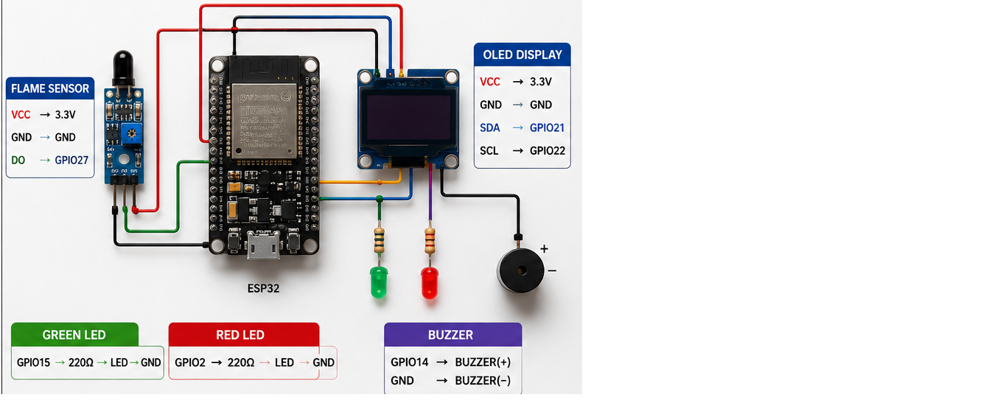
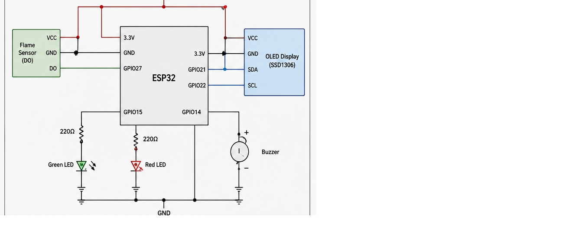
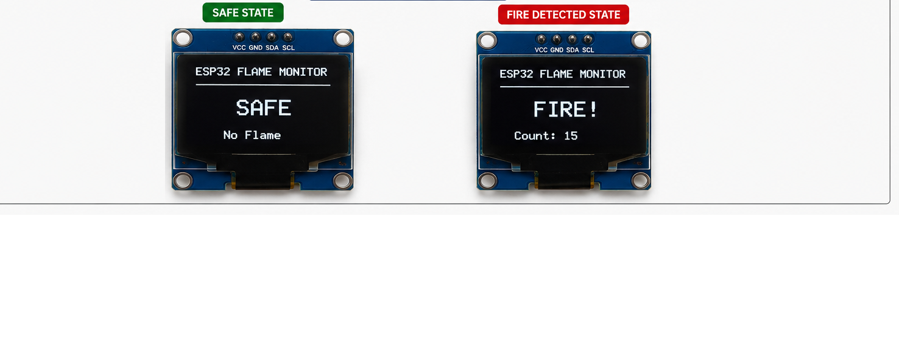

# ESP32 Flame Detection Alarm System

ESP32-based fire detection and alarm system using a flame sensor, SSD1306 OLED display, LEDs, and buzzer for real-time flame monitoring and emergency alert indication.

---

## Overview

The ESP32 Flame Detection Alarm System is an embedded safety monitoring project designed to detect the presence of flames and provide immediate visual and audible alerts.

The system continuously monitors a flame sensor and operates in two states:

- SAFE
- FIRE DETECTED

When a flame is detected, the ESP32 activates a buzzer alarm, turns on a red warning LED, updates the OLED display, and logs the event through the serial monitor.

This project demonstrates practical embedded systems concepts including:

- Digital sensor interfacing
- Real-time monitoring
- Alarm systems
- OLED display control
- GPIO programming
- Embedded firmware development

---

## Features

- Real-time flame detection
- SSD1306 OLED display interface
- Audible buzzer alarm
- Visual LED status indication
- Fire detection counter
- Serial monitor debugging output
- ESP32 compatible
- Clean and documented firmware
- Simple state-based logic

---

## Hardware Components

| Component | Quantity |
|------------|------------|
| ESP32 Development Board | 1 |
| Flame Sensor Module | 1 |
| SSD1306 OLED Display (128×64 I²C) | 1 |
| Green LED | 1 |
| Red LED | 1 |
| Buzzer | 1 |
| 220Ω Resistors | 2 |
| Jumper Wires | Several |

---

## Pin Configuration

### Flame Sensor

| Flame Sensor Pin | ESP32 Pin |
|------------------|------------|
| VCC | 3.3V |
| GND | GND |
| DO | GPIO27 |

---

### OLED Display

| OLED Pin | ESP32 Pin |
|----------|------------|
| VCC | 3.3V |
| GND | GND |
| SDA | GPIO21 |
| SCL | GPIO22 |

---

### LEDs

| LED | ESP32 GPIO |
|------|------------|
| Green LED | GPIO15 |
| Red LED | GPIO2 |

---

### Buzzer

| Buzzer | ESP32 GPIO |
|---------|------------|
| Positive (+) | GPIO14 |
| Negative (-) | GND |

---

## System States

### SAFE State

Condition:


No flame detected


Outputs:

Green LED  : ON
Red LED    : OFF
Buzzer     : OFF
OLED       : SAFE
```

---

### FIRE DETECTED State

Condition:


Flame detected


Outputs:


Green LED  : OFF
Red LED    : ON
Buzzer     : ON
OLED       : FIRE DETECTED


---

## How It Works

### Step 1 – System Initialization

The ESP32 initializes:

- OLED display
- Flame sensor
- LEDs
- Buzzer

---

### Step 2 – Flame Monitoring

The flame sensor continuously checks for infrared light emitted by flames.

Examples:

- Candle flame
- Lighter flame
- Match flame
- Small fire source

---

### Step 3 – State Evaluation

The ESP32 reads the digital output from the flame sensor.


int flameState = digitalRead(FLAME_SENSOR);```

---

### Step 4 – SAFE State

If no flame is present:


SAFE


The system:

- Turns on the green LED
- Turns off the red LED
- Disables the buzzer
- Displays SAFE on the OLED

---

### Step 5 – FIRE DETECTED State

If a flame is detected:


FIRE DETECTED


The system:

- Turns on the red LED
- Activates the buzzer
- Displays FIRE on the OLED
- Increments the fire detection counter

---

### Step 6 – Continuous Monitoring

The process repeats continuously, providing real-time monitoring and alerts.

---

## Example OLED Screens

### SAFE


ESP32 FLAME MONITOR

SAFE

No Flame


---

### FIRE DETECTED


ESP32 FLAME MONITOR

FIRE!

Count: 15


---

## Wiring Diagram



---

## Circuit Diagram



---

## OLED Display Preview



---

## Demo Video

A demonstration video of the project is included:


docs/demo_video.mp4


---

## Software Requirements

### Arduino IDE

Recommended version:


Arduino IDE 2.x


---

### ESP32 Board Package

Install the ESP32 board package from the Arduino Boards Manager.

---

### Required Libraries

Install the following libraries using the Arduino Library Manager:

```text
Adafruit GFX Library
Adafruit SSD1306 Library
Wire Library
```

---

## Installation

### Clone Repository

```bash
git clone https://github.com/your-username/ESP32-Flame-Detection-Alarm-System.git
```

---

### Open Project

Open:

```text
src/ESP32_Flame_Detection_Alarm_System.ino
```

in Arduino IDE.

---

### Select Board

```text
Tools → Board → ESP32 Dev Module
```

---

### Upload Firmware

Connect the ESP32 through USB and upload the firmware.

---

### Open Serial Monitor

Set baud rate:

```text
115200
```

The system will report:

```text
SAFE
```

or

```text
FIRE DETECTED
```

---

## Project Structure

```text
ESP32-Flame-Detection-Alarm-System
│
├── docs
│   ├── wiring.png
│   ├── circuit_diagram.png
│   ├── oled_active.png
│   └── demo_video.mp4
│
├── src
│   └── ESP32_Flame_Detection_Alarm_System.ino
│
├── LICENSE
│
└── README.md
```

---

## Educational Objectives

This project demonstrates:

- Digital sensor interfacing
- Embedded alarm systems
- OLED display programming
- GPIO control
- Real-time monitoring
- Safety system design
- Event detection
- Embedded firmware development

---

## Future Improvements

Possible future enhancements:

- Flame intensity measurement using analog output
- Wi-Fi notifications
- MQTT integration
- Mobile alerts
- Data logging
- Cloud dashboard
- SD card storage
- FreeRTOS task management
- Multi-sensor fire monitoring
- Flame and gas sensor fusion

---


## Author

**Milad Mohseni**

Embedded Systems & IoT Engineer

Areas of Interest:

- Embedded Systems
- ESP32 Development
- IoT Applications
- Sensor Interfacing
- Firmware Development
- Real-Time Monitoring Systems

---

## License

This project is licensed under the MIT License.

See the LICENSE file for more information.
